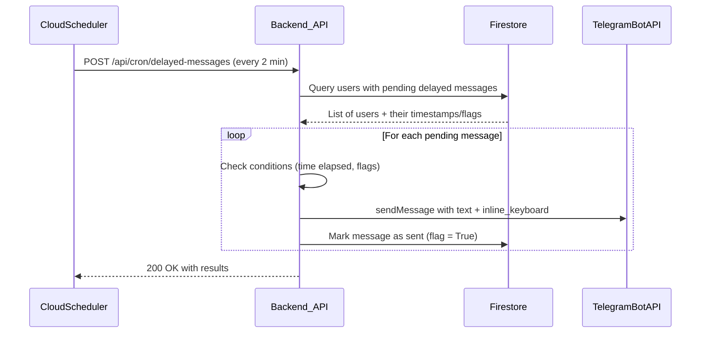

# Plan 2: Delayed Messages, Emoji Animation, Media Infrastructure

Implement the 5 delayed messages via a backend cron endpoint called by Cloud Scheduler every 2 minutes, add spinning moon emoji animation to m6, and prepare code infrastructure for media attachments (actual files to be added later).

---

## Architecture



---

## 1. New Firestore fields

Add to `create_user()` in both [`backend/firestore.py`](backend/firestore.py) and `ensure_user_exists()` in [`bot/firestore.py`](bot/firestore.py):

```python
"started_at": None,              # set on /start
"template_selected_at": None,    # set on template selection
"last_generation_at": None,      # set after successful generation
"m2_sent": False,
"m5_sent": False,
"m10_1_sent": False,
"m10_2_sent": False,
"m12_sent": False,
"m9_sent_at": None,              # timestamp when m9 was shown
"any_pack_purchased": False,
```

Add helper `set_user_timestamp(telegram_id, field, value)` in [`bot/firestore.py`](bot/firestore.py).

## 2. Record timestamps on user actions

| Event | File | Field to set |

|-------|------|-------------|

| `/start` (new user only) | [`bot/handlers/start.py`](bot/handlers/start.py) | `started_at = now()` |

| Template selected | [`bot/handlers/template_selection.py`](bot/handlers/template_selection.py) | `template_selected_at = now()` |

| Successful generation | [`bot/handlers/photo.py`](bot/handlers/photo.py) | `last_generation_at = now()` |

| m9 shown | [`bot/handlers/photo.py`](bot/handlers/photo.py) | `m9_sent_at = now()` (already sets `m9_shown=True`, add timestamp) |

## 3. Raw keyboards module for backend

Create [`backend/keyboards_raw.py`](backend/keyboards_raw.py) -- dict-format versions of inline keyboards for use with raw Telegram API (the backend sends messages via HTTP, not aiogram). Needed keyboards:

- `kb_template_grid_raw(mini_app_url)` -- for m2, m10.1, m10.2
- `kb_downsell_raw()` -- for m12

These mirror the aiogram keyboards from [`bot/keyboards.py`](bot/keyboards.py) but as plain dicts.

## 4. Cron endpoint for delayed messages

Add to [`backend/routers/cron.py`](backend/routers/cron.py):

```
POST /api/cron/delayed-messages
```

Five queries against Firestore, each checking timestamp + flags:

| Message | Firestore query | Time condition | Extra conditions |

|---------|----------------|----------------|-----------------|

| m2 | `m2_sent == False` | `started_at + 1h < now` | `successful_generations == 0` |

| m5 | `m5_sent == False` | `template_selected_at + 7min < now` | `successful_generations < 3`, `template_selected_at > last_generation_at` (or `last_generation_at is None`) |

| m10.1 | `m10_1_sent == False` | `last_generation_at + 60min < now` | `successful_generations == 1` |

| m10.2 | `m10_2_sent == False` | `last_generation_at + 60min < now` | `successful_generations == 2` |

| m12 | `m12_sent == False` | `m9_sent_at + 24h < now` | `any_pack_purchased == False` |

For each matching user, call `TelegramNotificationService.send_message()` with the message text (from imported `bot/messages.py` functions) and raw keyboard dict, then update the flag in Firestore.

Add Firestore helper `get_users_for_delayed_messages()` in [`backend/firestore.py`](backend/firestore.py) that returns users grouped by message type.

## 5. Extend TelegramNotificationService

In [`backend/services/notifications.py`](backend/services/notifications.py), add 5 methods:

- `send_m2_reminder(telegram_id)` -- text from `m2_reminder()`, keyboard `kb_template_grid_raw()`
- `send_m5_photo_reminder(telegram_id)` -- text from `m5_photo_reminder()`, no keyboard
- `send_m10_1_tips(telegram_id)` -- text from `m10_1_tips_after_first()`, keyboard `kb_template_grid_raw()`
- `send_m10_2_pro_suggestion(telegram_id)` -- text from `m10_2_pro_suggestion()`, keyboard `kb_template_grid_raw()`
- `send_m12_downsell(telegram_id)` -- text from `m12_downsell()`, keyboard `kb_downsell_raw()`

## 6. Emoji animation in m6

In [`bot/handlers/photo.py`](bot/handlers/photo.py), after sending the m6 status message, launch a background coroutine:

```python
MOON_PHASES = "🌑🌘🌗🌖🌕🌔🌓🌒"
stop_event = asyncio.Event()

async def animate(msg, stop_event):
    i = 0
    while not stop_event.is_set():
        phase = MOON_PHASES[i % len(MOON_PHASES)]
        try:
            await msg.edit_text(f"{phase} Генерируем ваше фото…\n\n⏱️ Будет готово через 10–30 секунд")
        except Exception:
            break
        i += 1
        await asyncio.sleep(1)

task = asyncio.create_task(animate(status_message, stop_event))
```

Before deleting the status message, set `stop_event.set()` and `await task` (with try/except). This cleanly stops the animation.

## 7. Media asset infrastructure

Prepare code to send photos/video with messages, but use placeholder logic since actual files are not yet available:

- Add `cover_image` field to styles in [`bot/styles_data.py`](bot/styles_data.py) (default `None`)
- In [`bot/handlers/template_selection.py`](bot/handlers/template_selection.py) and [`bot/handlers/start.py`](bot/handlers/start.py): check if `cover_image` or video is set -- if yes, use `answer_photo()`/`answer_video()`, otherwise fall back to `answer()` (text only, current behavior)
- In `m1_welcome()`: add an optional `video_file_id` parameter; if provided, handler sends video message instead of text
- This way, when assets are ready, we just set the file IDs/URLs and everything works

## 8. Cloud Scheduler job + deploy

Create Cloud Scheduler job via gcloud CLI in `seeyay-ai-dev`:

```bash
gcloud scheduler jobs create http delayed-messages \
    --location=europe-west4 \
    --schedule="*/2 * * * *" \
    --uri="https://seeyay-api-269162169877.europe-west4.run.app/api/cron/delayed-messages" \
    --http-method=POST \
    --headers="Authorization=Bearer CRON_TOKEN" \
    --project=seeyay-ai-dev
```

Deploy all services via `cloudbuild-dev.yaml`, test all 5 delayed messages, then git push to dev.

---

## Files changed

| File | Change |

|------|--------|

| [`backend/firestore.py`](backend/firestore.py) | New fields in `create_user()`, new `get_users_for_delayed_messages()` |

| [`bot/firestore.py`](bot/firestore.py) | New fields in `ensure_user_exists()`, new `set_user_timestamp()` |

| [`bot/handlers/start.py`](bot/handlers/start.py) | Record `started_at`, media infrastructure |

| [`bot/handlers/template_selection.py`](bot/handlers/template_selection.py) | Record `template_selected_at`, media infrastructure |

| [`bot/handlers/photo.py`](bot/handlers/photo.py) | Record `last_generation_at`, `m9_sent_at`, emoji animation |

| [`backend/keyboards_raw.py`](backend/keyboards_raw.py) | **New file** -- dict-format keyboards |

| [`backend/routers/cron.py`](backend/routers/cron.py) | New `delayed-messages` endpoint |

| [`backend/services/notifications.py`](backend/services/notifications.py) | 5 new send methods |

| [`bot/styles_data.py`](bot/styles_data.py) | Add `cover_image` field |