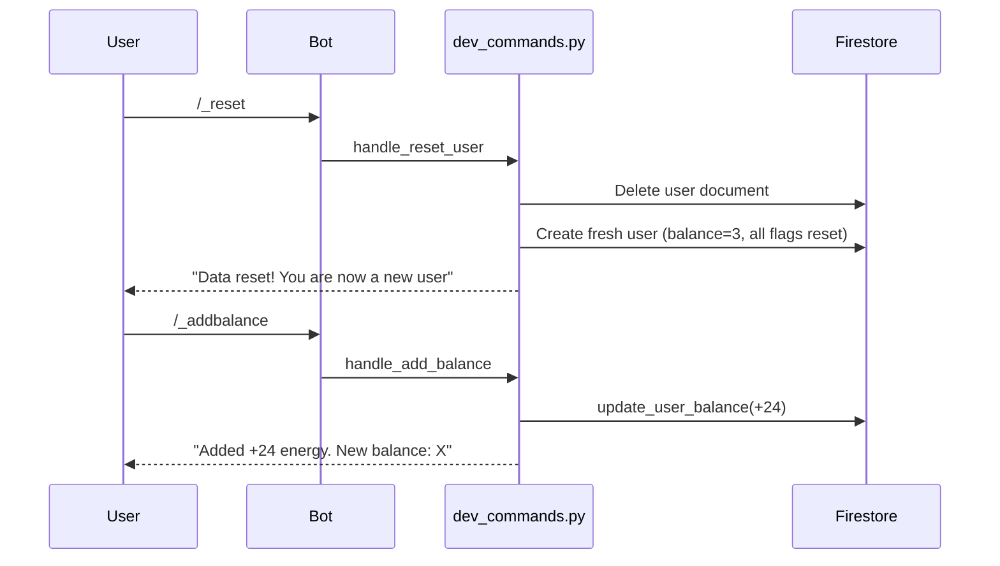

# Dev Testing Commands

Create isolated dev commands for bot testing that can be easily removed before production deployment.

## Architecture




## Implementation Steps

### 1. Create `[bot/handlers/dev_commands.py](bot/handlers/dev_commands.py)`

New file with two command handlers:

**Command: `/_reset**`

- Delete user document from Firestore
- Call `ensure_user_exists()` to recreate with fresh defaults:
                          - `balance: 3`
                          - `successful_generations: 0`
                          - `is_new_user: True`
                          - All message flags (`m7_1_sent`, `m7_2_sent`, `m7_3_sent`, `m9_shown`) reset to `False`
                          - `starter_pack_purchased: False`
- Reply: "✅ Твои данные сброшены! Ты снова новый пользователь с 3⚡"

**Command: `/_addbalance**`

- Call `update_user_balance(telegram_id, +24)`
- Get updated user to show new balance
- Reply: "✅ Добавлено +24⚡\n💰 Текущий баланс: {balance}⚡"

**No access control** - any user in dev environment can use these commands (as per user's choice).

```python
from aiogram import Router, F
from aiogram.types import Message
from aiogram.filters import Command
import logging

from bot.firestore import ensure_user_exists, update_user_balance, get_user, get_db

router = Router()
logger = logging.getLogger(__name__)

@router.message(Command("_reset"))
async def cmd_reset_user(message: Message):
    """DEV ONLY: Reset user to fresh state"""
    telegram_id = message.from_user.id
    username = message.from_user.username or message.from_user.first_name
    
    try:
        # Delete existing user document
        db = get_db()
        await db.collection("users").document(str(telegram_id)).delete()
        logger.info(f"DEV: Deleted user {telegram_id}")
        
        # Recreate with fresh defaults
        await ensure_user_exists(telegram_id, username)
        logger.info(f"DEV: Recreated user {telegram_id} with fresh data")
        
        await message.answer(
            "✅ Твои данные сброшены!\n\n"
            "💫 Ты снова новый пользователь\n"
            "⚡️ Баланс: 3 энергии\n"
            "🎯 Все достижения сброшены"
        )
    except Exception as e:
        logger.error(f"DEV: Error resetting user {telegram_id}: {e}")
        await message.answer(f"❌ Ошибка сброса: {e}")

@router.message(Command("_addbalance"))
async def cmd_add_balance(message: Message):
    """DEV ONLY: Add +24 energy to balance"""
    telegram_id = message.from_user.id
    
    try:
        result = await update_user_balance(telegram_id, 24)
        if result:
            new_balance = result.get("balance", 0)
            await message.answer(
                f"✅ Добавлено +24⚡\n\n"
                f"💰 Текущий баланс: {new_balance}⚡"
            )
            logger.info(f"DEV: Added +24 energy to user {telegram_id}, new balance: {new_balance}")
        else:
            await message.answer("❌ Пользователь не найден. Используй /start сначала")
    except Exception as e:
        logger.error(f"DEV: Error adding balance to {telegram_id}: {e}")
        await message.answer(f"❌ Ошибка добавления энергии: {e}")
```

### 2. Register router in `[bot/handlers/__init__.py](bot/handlers/__init__.py)`

Add import and export:

```python
from .start import router as start_router
from .photo import router as photo_router
from .template_selection import router as template_selection_router
from .energy import router as energy_router
from .dev_commands import router as dev_commands_router  # DEV ONLY - REMOVE BEFORE PROD

__all__ = [
    "start_router",
    "template_selection_router",
    "energy_router",
    "photo_router",
    "dev_commands_router"  # DEV ONLY - REMOVE BEFORE PROD
]
```

### 3. Include router in `[bot/main.py](bot/main.py)`

Add to imports and router registration:

```python
from bot.handlers import (
    start_router,
    template_selection_router,
    energy_router,
    photo_router,
    dev_commands_router  # DEV ONLY - REMOVE BEFORE PROD
)

# Register routers
dp.include_router(start_router)
dp.include_router(template_selection_router)
dp.include_router(energy_router)
dp.include_router(photo_router)
dp.include_router(dev_commands_router)  # DEV ONLY - REMOVE BEFORE PROD
```

### 4. Reset user 225190081 immediately

Create one-time script `[scripts/reset_user_225190081.py](scripts/reset_user_225190081.py)`:

```python
"""
One-time script to reset user 225190081 to fresh state
Run: python -m scripts.reset_user_225190081
"""
import asyncio
from google.cloud import firestore

async def reset_user():
    db = firestore.AsyncClient()
    user_id = "225190081"
    
    # Delete and recreate
    await db.collection("users").document(user_id).delete()
    print(f"Deleted user {user_id}")
    
    # Create fresh user
    await db.collection("users").document(user_id).set({
        "username": "your_username",  # Update with actual username
        "plan": "free",
        "balance": 3,
        "created_at": firestore.SERVER_TIMESTAMP,
        "successful_generations": 0,
        "is_new_user": True,
        "starter_pack_purchased": False,
        "m9_shown": False,
        "m7_1_sent": False,
        "m7_2_sent": False,
        "m7_3_sent": False,
    })
    print(f"Recreated user {user_id} with fresh defaults")
    
    await db.close()

if __name__ == "__main__":
    asyncio.run(reset_user())
```

Run once to reset your data before testing bot.

### 5. Add cleanup reminder to README

Add to `[README.md](README.md)` in "Деплой на Production" section:

```markdown
### ⚠️ Pre-Production Checklist

Before deploying to production, remove dev-only code:

1. Delete file: `bot/handlers/dev_commands.py`
2. Remove from `bot/handlers/__init__.py`:
   - Import line with `dev_commands_router`
   - Export in `__all__` list
3. Remove from `bot/main.py`:
   - Import line with `dev_commands_router`
   - `dp.include_router(dev_commands_router)` line
4. Search codebase for "DEV ONLY" comments and remove them

```bash
# Verify no dev commands remain
grep -r "dev_commands" bot/
grep -r "_reset\|_addbalance" bot/handlers/
```

```

## Files to Create/Modify

| File | Action | Description |

|------|--------|-------------|

| `bot/handlers/dev_commands.py` | **Create** | Two commands: `/_reset` and `/_addbalance` |

| `bot/handlers/__init__.py` | **Modify** | Add import/export with "DEV ONLY" comments |

| `bot/main.py` | **Modify** | Include router with "DEV ONLY" comments |

| `scripts/reset_user_225190081.py` | **Create** | One-time script to reset your user |

| `README.md` | **Modify** | Add pre-production cleanup checklist |

## Testing

After deployment:

1. Run reset script: `python -m scripts.reset_user_225190081` (one time)
2. In Telegram bot, send `/_reset` → verify data reset
3. Send `/_addbalance` → verify +24 energy added
4. Test full message chain from Plan 1 as new user
5. Use `/_reset` anytime to start fresh

## Daily Energy Bonus Note

User mentioned "1 раз в сутки" (once per day) energy bonus - this feature is not currently implemented in the codebase. Only starting balance of 3 energy exists. If needed, this would require:

- New field: `last_daily_bonus_claimed_at`
- Cron job or check on user action to grant +1 daily
- Should be added in a future plan if required

## Removal Before Production

Simply delete 3 files and remove 4 lines of code marked with "DEV ONLY" comments. All dev functionality is isolated in one handler file.
```

